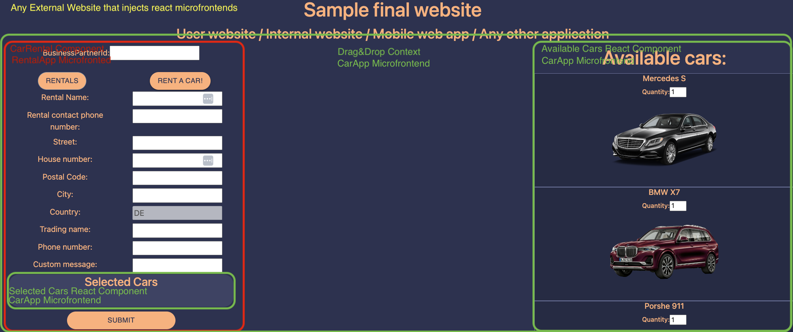
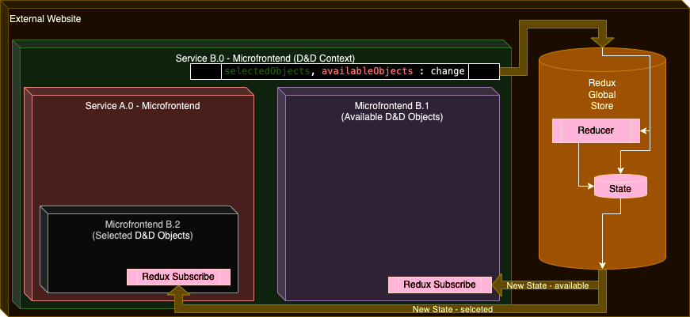

# Drag & Drop Over React Microfrontends - PoC

PoC implementation of Drag And Drop functionality over React Microfrontends with Redux.

It was just a quick PoC, not production app; so no frontend tests; no frontend fireworks; little focus on code clarity and structure :)

## Demo how does it work: 
 Note: Video/Gif drastically slows drag and drop but real app is smooth


##  Marked microfrontend React components that are injected in sample app:


## Component diagram:


## How to run it:

1) Run rental-app
   - `cd micro-frontends/rental-app`
   - `yarn`
   - `yarn start` 
   - Microfrontend exposed: http://localhost:30001/carRentalRemoteEntry.js
2) Run car-app
   - `cd micro-frontends/car-app`
   - `yarn`
   - `yarn start` 
   - Microfrontend exposed: http://localhost:30002/carRemoteEntry.js
3) Run sample stub
   - `cd stubs/master-stub`
   - `yarn`
   - `yarn start` 
   - Demo app exposed: http://localhost:40001

```
Tested on:
-  yarn 1.22.18
-  node/20.10.0
```


## Any external website/webapp wanting to include microfrontends:
1) Configure modulefederation to point to microfrontends:
```js
module.exports = {
  name: "master",
  remotes: {
    rental: `rental@${RENTAL_REACT_ENDPOINT}`,
    car: `car@${CAR_REACT_ENDPOINT}`
  },
  shared: {
    ...dependencies,
    react: {
      singleton: true,
      requiredVersion: dependencies['react'],
    },
    'react-dom': {
      singleton: true,
      requiredVersion: dependencies['react-dom'],
    },
  },
};
```

2) Depends if TS/JS import external modules:


- car-decl.d.ts
    ```ts
    declare module "car/CarDragDropContext";
    declare module "car/AvailableCars";
    declare module "car/SelectedCars";
    ```
- rental-decl.d.ts
    ```ts
    declare module "rental/CarRental";;
    ```
- App.tsx:
    ```ts
    import "./rental-decl.d.ts";
    import "./car-decl.d.ts";
    const RemoteCarRentalForm = React.lazy(() => import("rental/CarRental"));
    const CarDragDropContext = React.lazy(
        () => import("car/CarDragDropContext")
    );
    const AvailableCars = React.lazy(
        () => import("car/AvailableCars")
    );
    ```

    - Then somewhere on your website/webapp add drag and drop context (where drag&drop functionality should work) 
    - and place rental form somewhere and available cars elsewhere:
    ```jsx
    <CarDragDropContext>
        <RemoteCarRentalForm businessPartnerId={bpId}/>
        <AvailableCars />
    </CarDragDropContext>
    ```
    - Benefits
      -  Microfrontends can be transparently and independently delivered, new version would be automatically loaded on all websites (Without breaking changes i.e. passing additional arguments to microfrontend): 
      -  You can reuse microfrontends at many websites at the same time hosting only one microfrontend
      -  It can support OAuth easily
      -  You can hide technicalities within microfrontends and reduce knowledge share between teams
      -  One team can deliver backend + small frontend stuff
      -  You can hold state within microfrontend
      -  And many many more ; Drag & Drop it's just prove that even the most complex interactions between different microfrontends are possible (for example with Redux but there are other options); so there is no need to treat them as fully autonomous pieces of frontend - however it slightly complicates solution
